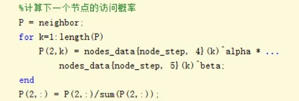
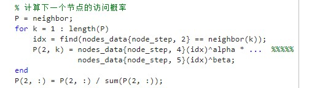
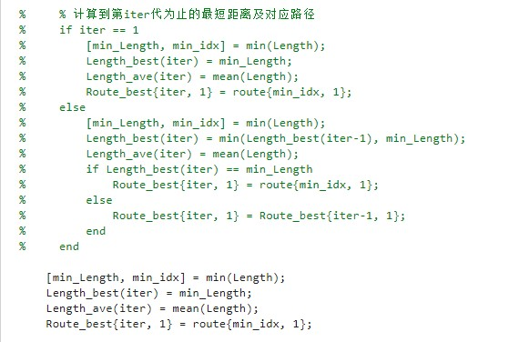
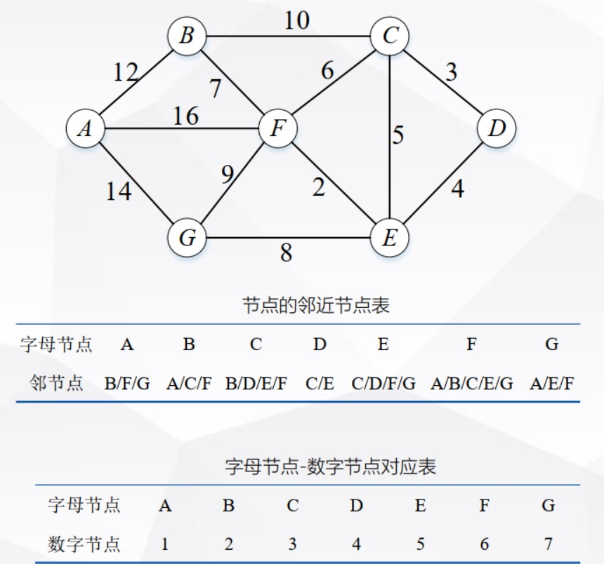
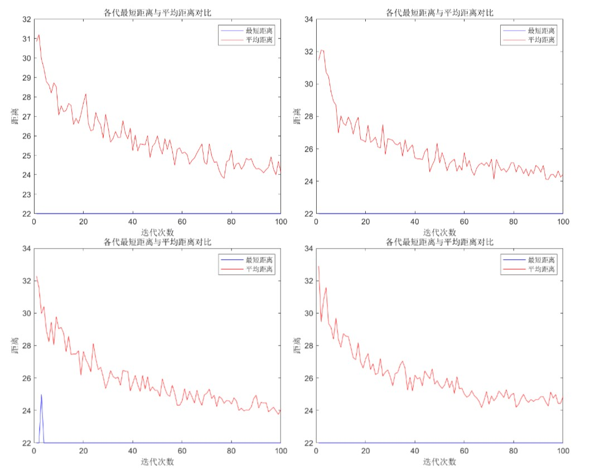
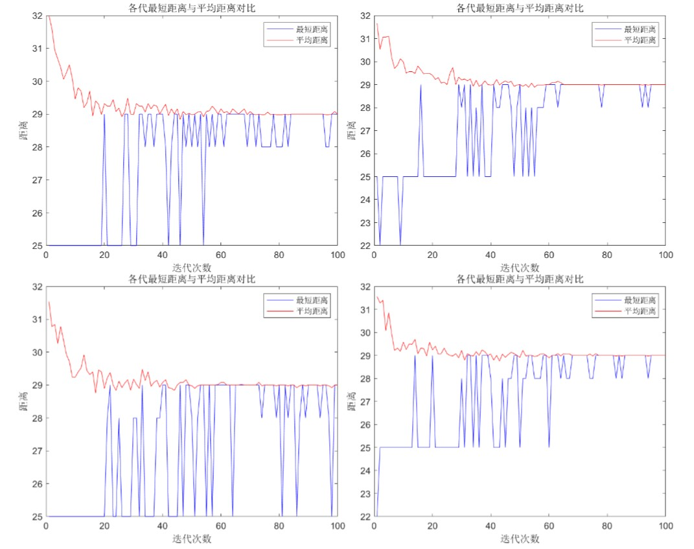
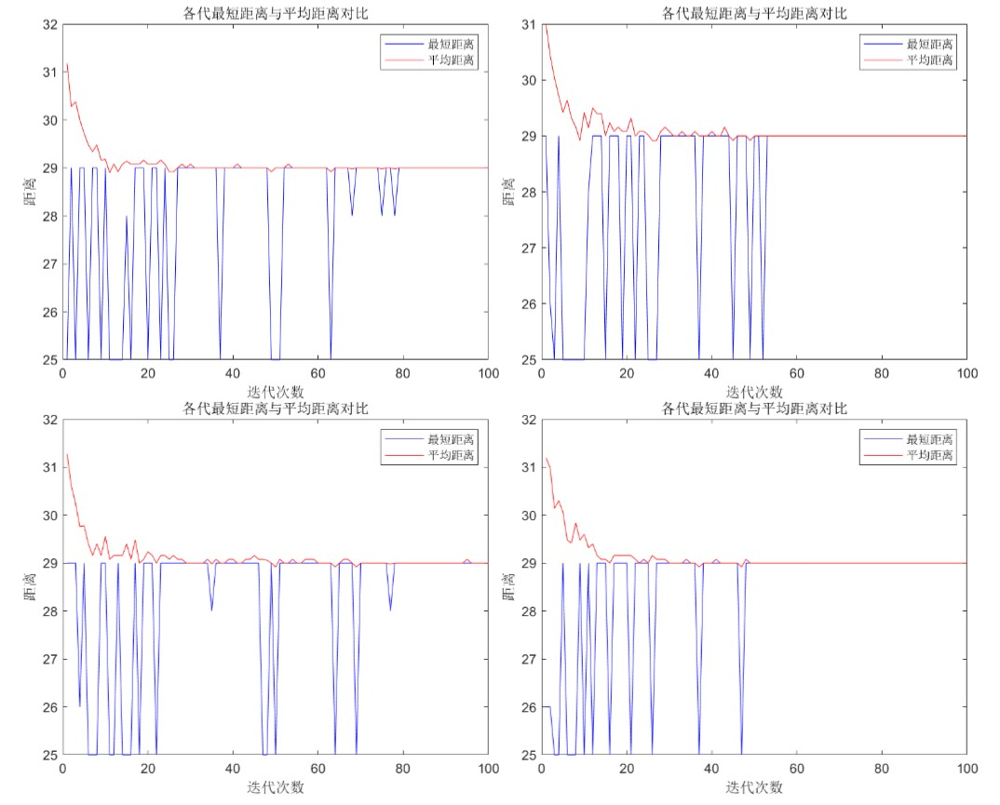

# 基于Matlab使用蚁群算法寻找最优路径

与Dijkstra算法使用相同的地图。

# 参考：

1. <https://www.bilibili.com/video/BV1dA411s7Eb?spm_id_from=333.1007.top_right_bar_window_history.content.click&vd_source=be5bd51fafff7d21180e251563899e5e>
2. 《智能优化算法及其MATLAB实例（第2版）》by包子阳 P102 例5.1

# 文件说明

Example5_1.m 简单对参考资料2中的代码进行重现；

ACA.m 对参考资料1中的代码进行重现，并适当优化代码且修改错误，错误如下：

计算P(2,k)有问题，neighbor已经删除了不可访问节点，所以neighbor中节点的索引号和nodes_data{node_step, 4}索引号不是一一对应关系，应该先找到对应的索引号。
修正：

# 实验

**信息素启发式因子α** 代表信息量对是否选择当前路径的影响程度， 即反映蚂蚁在运动过程中所积累的信息量在指导蚁群搜索中的相对重要程度。 α 的大小反映了蚁群在路径搜索中随机性因素作用的强度， 其值越大， 蚂蚁在选择以前走过的路径的可能性就越大， 搜索的随机性就会减弱； 而当启发式因子α的值过小时， 则易使蚁群的搜索过早陷于局部最优。 根据经验， 信息素启发式因子α取值范围一般为[l， 4]时， 蚁群算法的综合求解性能较好。

**期望启发因子β** 表示在搜索时路径上的信息素在指导蚂蚁选择路径时的向导性， 它的大小反映了蚁群在搜索最优路径的过程中的先验性和确定性因素的作用强度。 期望启发因子β的值越大， 蚂蚁在某个局部点上选择局部最短路径的可能性就越大， 虽然这个时候算法的收敛速度得以加快， 但蚁群搜索最优路径的随机性减弱， 而此时搜索易于陷入局部最优解。 根据经验， 期望启发因子β取值范围一般为[3， 5]， 此时蚁群算法的综合求解性能较好。
参考:《智能优化算法及其MATLAB实例（第2版）》by包子阳 P101 例5.1

对结果的显示进行一定修改，以查看每一次迭代的最佳结果：

Dijkstra算法示例中求出的最优路径为：4-5-6-1
修改$\beta$值重复四次实验

1. $\beta=0$
实践中$\beta$不应等于0，但为了说明距离这样的先验信息起的作用，取$\beta=0$，实验结果：

2. $\beta=3$

3. $\beta=5$

对比三个实验中纵坐标最小值可以看出，$\beta$越大，算法越易陷入局部最优。

1. 实验一最优值全为22，是全局最优，最优路径 4-5-6-1。
2. 实验二2个22，2个25；
3. 实验三全为25，均为局部最优，局部最优路径 4-5-6-2-1。

讨论：

- 位于节点6时，接下来应该选择节点1还是节点2受到信息素和启发因子的影响，当$\beta$较大时，更看重启发信息，即更加偏向与选择距离短的节点(节点6->节点1距离为16，节点6->节点2距离为7)，因此才会出现实验三的结果。当$\beta=0$时，启发信息不起作用，选择全取决于信息素，这种情况更贴近自然中的蚁群寻路。
- 群智能算法都有陷入局部最优的问题